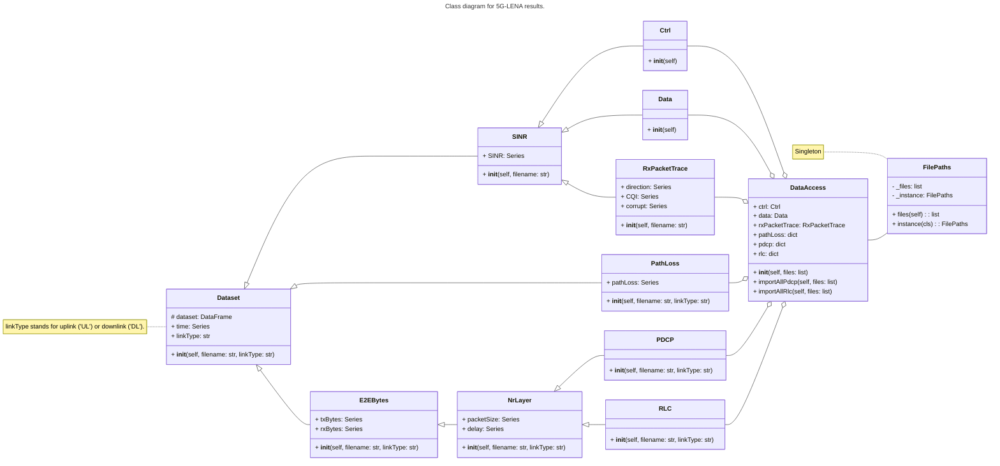

<pre align="center">
    Centro Federal de Educação Tecnológica de Minas Gerais  
    Curso Técnico Integrado em Informática
</pre>

# Monetização do 5G em Cenários Locais e Implementação de Microoperadoras

**Equipe:** ANDRADE DA SILVA, A. L; STORCK, C. R. (orientador); SANTOS DA CRUZ, L. V.; MARIANO, V. G. R.

Neste repositório encontram-se todos os arquivos gerados pelos componentes do grupo a fim de realizar o projeto de Trabalho de Conclusão de Curso (TCC) do Curso Técnico Integrado em Informática do Centro Federal de Educação Tecnológica de Minas Gerais (CEFET-MG).

# Índice

- [Simulação](#simulação)
- [Tabela de Informações](#tabela-de-informações)
- [Diagrama de Classes](#diagrama-de-classes)

# Simulação

Como explicado na seção 2 do relatório final, o software utilizado para a realização da simulação foi o simaldor NS-3 equipado do módulo 5G-LENA.

Nesta seção, é tratada uma explicação das saídas da simulação do arquivo *cttc-nr-traffic-ngmn-mixed.cc*, que pode ser encontrado no repositório do CTTC *"3GPP NR ns-3 module"*, além do diagrama de classes.

## Tabela de Informações

A tabela abaixo lista a maior parte das informações coletadas das simulações feitas pela equipe. Algumas informações, como as saídas da camada PHY e MAC não estão presentes, pois, por motivos explicados na seção 2 do relatório final, essas informações não são relevantes para a pesquisa.

<table align="center">
    <thead>
        <th colspan="5">Dados para cada arquivo</th>
        <tr>
            <th>Dado</th>
            <th>Unidade</th>
            <th colspan="3">Arquivos</th>
        </tr>
    </thead>
    <tbody>
        <tr rowspan="2">
            <td rowspan="2">SINR</td>
            <td rowspan="2">dB</td>
            <th>PDCP</th>
            <th>RLC</th>
            <th>Others</th>
            <tr>
                <td>-</td>
                <td>-</td>
                <td>
                    
DlCtrlSinr

                    
DlDataSinr

                    
RxPacketTrace

                </td>
            </tr>
        </tr>
        <tr rowspan="2">
            <td rowspan="2">pathLoss</td>
            <td rowspan="2">dB</td>
            <th>PDCP</th>
            <th>RLC</th>
            <th>Others</th>
            <tr>
                <td>-</td>
                <td>-</td>
                <td>
                    
UlPathlossTrace

                    
DlPathlossTrace

                </td>
            </tr>
        </tr>
        <tr rowspan="2">
            <td rowspan="2">time</td>
            <td rowspan="2">seconds</td>
            <th>PDCP</th>
            <th>RLC</th>
            <th>Others</th>
            <tr>
                <td>*</td>
                <td>*</td>
                <td>*</td>
            </tr>
        </tr>
        <tr rowspan="2">
            <td rowspan="2">packetSize</td>
            <td rowspan="2">bytes</td>
            <th>PDCP</th>
            <th>RLC</th>
            <th>Others</th>
            <tr>
                <td>
                    
NrDlPdcpRxStats

                    
NrDlPdcpTxStats

                    
NrUlPdcpRxStats

                    
NrUlPdcpTxStats

                </td>
                <td>
                    
NrDlRlcRxStats

                    
NrDlRlcTxStats

                    
NrUlRlcRxStats

                    
NrUlRlcTxStats

                </td>
                <td>-</td>
            </tr>
        </tr>
        <tr rowspan="2">
            <td rowspan="2">delay</td>
            <td rowspan="2">seconds</td>
            <th>PDCP</th>
            <th>RLC</th>
            <th>Others</th>
            <tr>
                <td>
                    
NrDlPdcpStatsE2E

                    
NrDlPdcpRxStats

                    
NrUlPdcpStatsE2E

                    
NrUlPdcpRxStats

                </td>
                <td>
                    
NrDlRlcStatsE2E

                    
NrDlRxRlcStats

                    
NrUlRlcStatsE2E

                    
NrUlRlcRxStats

                </td>
                <td>-</td>
            </tr>
        </tr>
        <tr rowspan="2">
            <td rowspan="2">TxBytes</td>
            <td rowspan="2">bytes</td>
            <th>PDCP</th>
            <th>RLC</th>
            <th>Others</th>
            <tr>
                <td>
                    
NrDlPdcpStatsE2E

                    
NrUlPdcpStatsE2E

                </td>
                <td>
                    
NrDlRlcStatsE2E

                    
NrUlRlcRxStats

                </td>
                <td>-</td>
            </tr>
        </tr>
        <tr rowspan="2">
            <td rowspan="2">RxBytes</td>
            <td rowspan="2">bytes</td>
            <th>PDCP</th>
            <th>RLC</th>
            <th>Others</th>
            <tr>
                <td>
                    
NrDlPdcpStatsE2E

                    
NrUlPdcpStatsE2E

                </td>
                <td>
                    
NrDlRlcStatsE2E

                    
NrUlRlcStatsE2E

                </td>
                <td>-</td>
            </tr>
        </tr>
        <tr rowspan="2">
            <td rowspan="2">direction</td>
            <td rowspan="2">UL/DL</td>
            <th>PDCP</th>
            <th>RLC</th>
            <th>Others</th>
            <tr>
                <td>-</td>
                <td>-</td>
                <td>RxPacketTrace</td>
            </tr>
        </tr>
        <tr rowspan="2">
            <td rowspan="2">CQI</td>
            <td rowspan="2">?</td>
            <th>PDCP</th>
            <th>RLC</th>
            <th>Others</th>
            <tr>
                <td>-</td>
                <td>-</td>
                <td>RxPacketTrace</td>
            </tr>
        </tr>
        <tr rowspan="2">
            <td rowspan="2">corrupt</td>
            <td rowspan="2">?</td>
            <th>PDCP</th>
            <th>RLC</th>
            <th>Others</th>
            <tr>
                <td>-</td>
                <td>-</td>
                <td>RxPacketTrace</td>
            </tr>
        </tr>
    </tbody>
</table>

**Legenda:** &nbsp;&nbsp;&nbsp;&nbsp; **-** : não possui. &nbsp;&nbsp;&nbsp;&nbsp; <strong>*</strong> : todos possuem.

[☝️ Retornar ao topo.](#monetização-do-5g-em-cenários-locais-e-implementação-de-microoperadoras)

## Diagrama de Classes

O diagrama de classes abaixo representa a forma com que o programa que faz a leitura dos arquivos e transforma as informações em gráficos foi desenvolvido. O programa será desenvolvido na linguagem de programação Python utilizando as bibliotecas Pandas e Matplotlib, como explicado nas seções 2 e 3 do relatório final.

[☝️ Retornar ao topo.](#monetização-do-5g-em-cenários-locais-e-implementação-de-microoperadoras)

